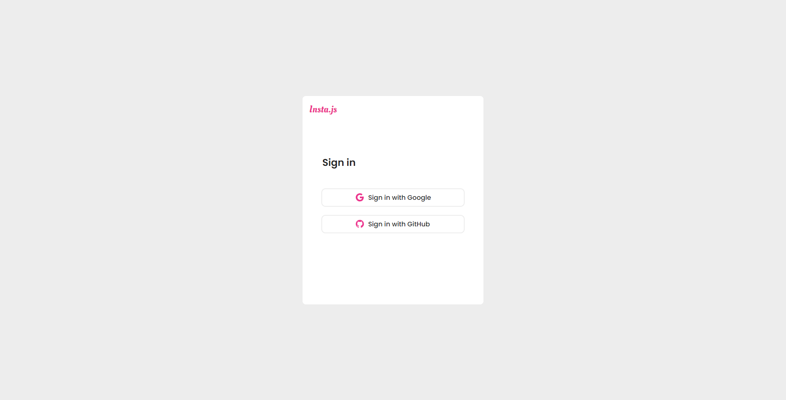
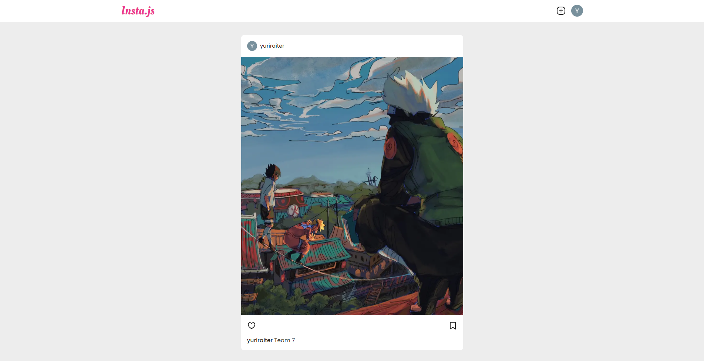
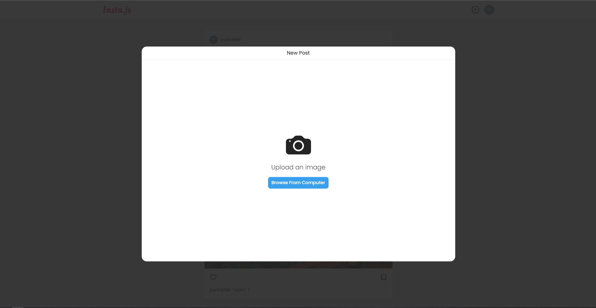
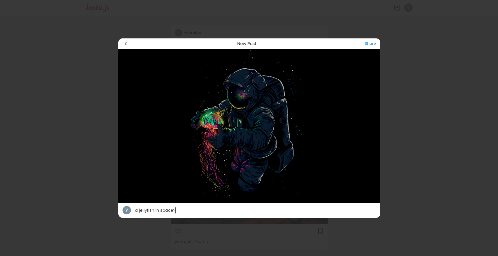
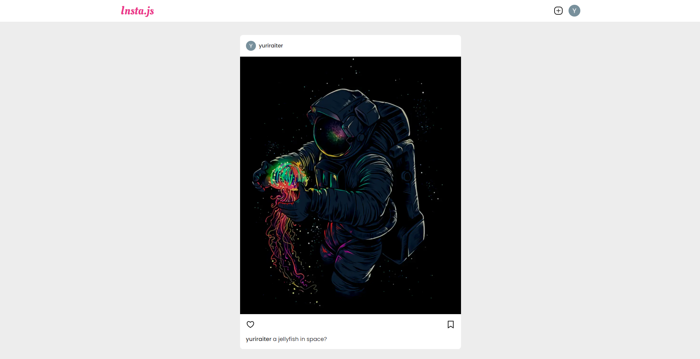

# Insta.js (not finished yet)

## Sign In Page

## Feed

## Upload Image Modal

## Chosen image preview and post message

## Uploaded post in the feed

### Description
It's a Next.js project that reproduces some functionalities of Instagram, like:
* Posts upload
* Realtime feed

### Firebase v9
It was used to store user data and set the login providers (Google and GitHub).

### NextAuth.js
It was used to handle authentication with the providers set in firebase and the user's session (if logged or not).

### Tech list
* Next.js
* Typescript
* Sass
* Firebase
* NextAuth.js
* react-modal
* react-icons
